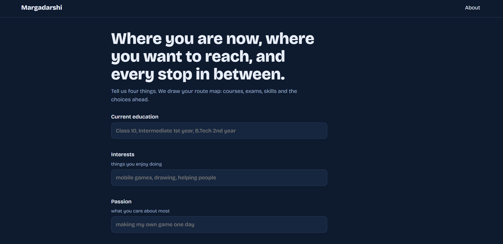
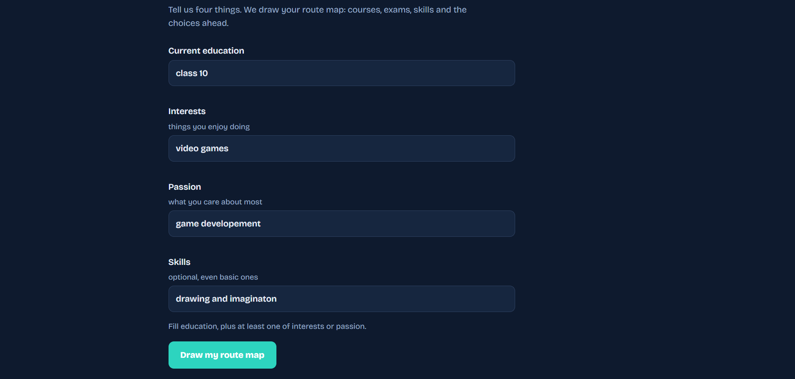
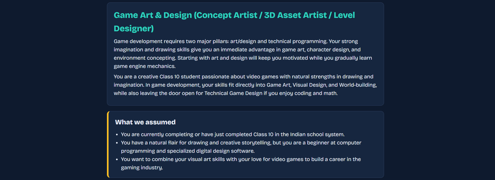
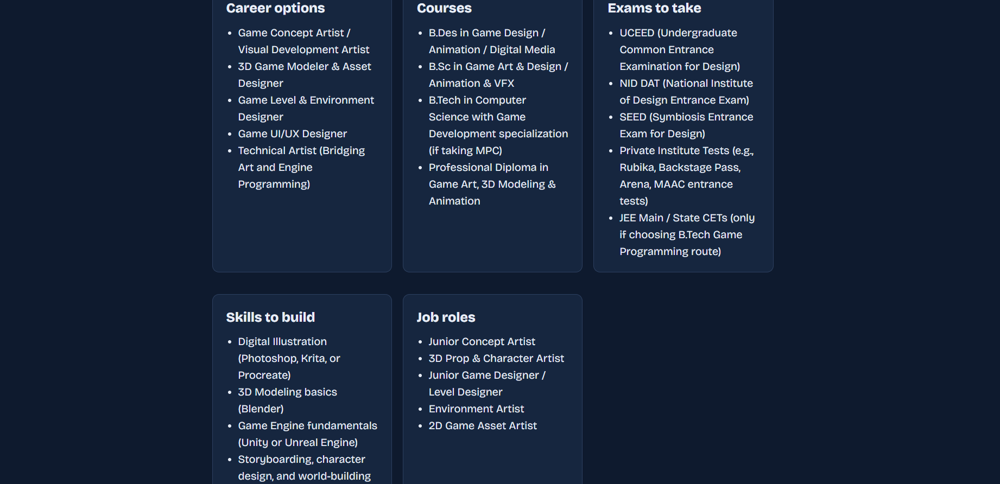
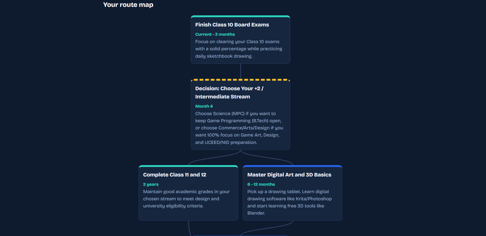
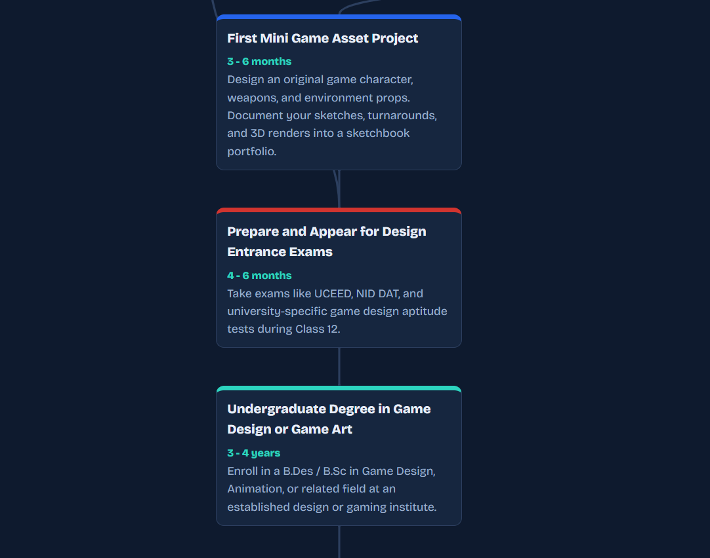
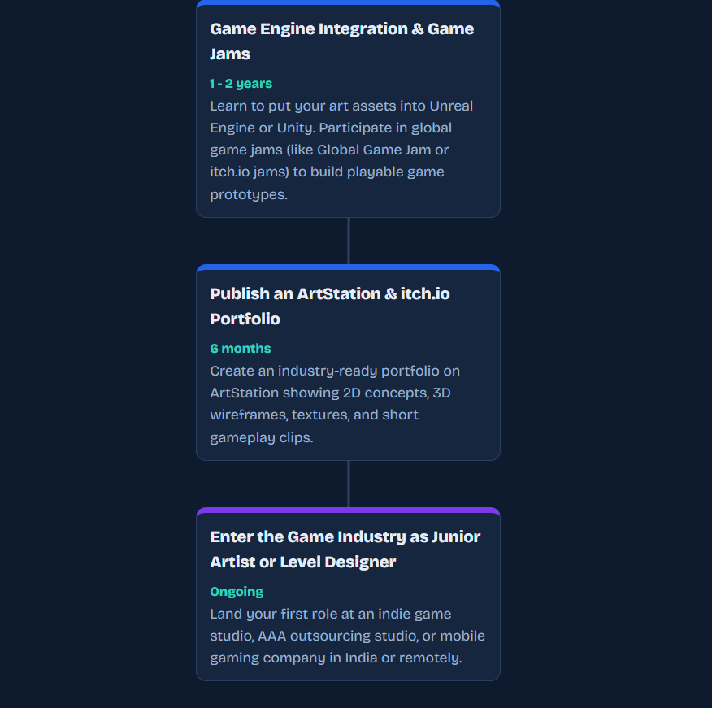
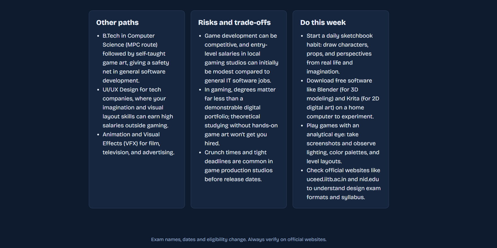
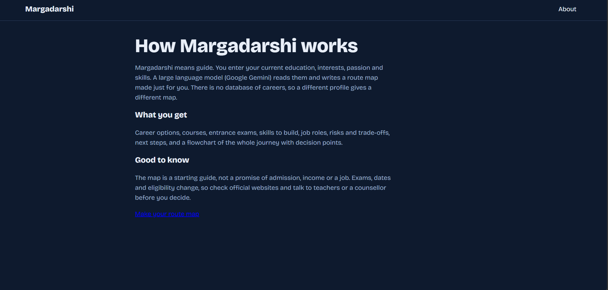

# Margadarshi: AI Route Map Generator for Students

**Margadarshi** (meaning *guide*) is an AI-powered web app that gives students a personalized route map for their future. A student enters four things: their **current education**, **interests**, **passion**, and **skills**. A large language model (Google Gemini) then writes a complete journey: the careers open to them, the courses and entrance exams to take, the skills to build, and a step-by-step flowchart from where they are now to where they want to reach.

There is **no database of careers**. Every route map is generated by the LLM from the student's input, so a different profile gives a different map.

> **Note for visitors:** this repository contains only the code, and there is no public live demo. To try the app, run it on your own computer with **your own free Gemini API key** (steps below). The author's key is not included and is never shared. The screenshots below show how it works.

## Features

- **Only 4 inputs**, simple enough for a Class 10 student to fill in under a minute
- **Complete guidance:** best-fit career, career options, courses, exams, skills, job roles
- **Visual route map:** a flowchart with decision points and branching paths
- **Honest advice:** alternatives, risks and trade-offs, and a "Do this week" action list
- **Handles tricky input:** conflicting interests become branching paths, money or fame interests are treated realistically, and unclear or inappropriate input gets a polite request for more detail
- **Clear assumptions:** if skills are left empty, the app says it assumed a beginner
- **Built for the Indian education system** (Intermediate streams, JEE, NEET, UCEED, and so on)

## Screenshots

### 1. Home page
The student sees a simple form with four inputs.



### 2. Entering details
Education is required, plus at least one of interests or passion. Skills are optional.



### 3. Best fit and assumptions
The AI explains the best-fit career and why, and lists what it assumed about the student.



### 4. Careers, courses and exams
Everything the student needs to know, in one place.



### 5. The route map
A flowchart from the student's current stage to a career. Dashed boxes are decision points, and box colors mark exams, skills, projects and jobs.







### 6. Other paths, risks and next steps
Alternatives, honest trade-offs, and things to do this week.



### 7. About page



## How it works

1. The student fills the form in the browser.
2. The browser validates the input and sends it to the Flask backend (`POST /api/analyze`).
3. Flask builds a prompt with rules for personalized, realistic, age-appropriate guidance, and calls Gemini asking for structured JSON.
4. The JSON includes the roadmap as a list of steps linked by `next` IDs.
5. The browser draws the summary cards and the flowchart from that JSON.

## Tech stack

- **Backend:** Python, Flask
- **AI:** Google Gemini API (`google-genai`) with structured JSON output and automatic retries
- **Frontend:** HTML, CSS, and vanilla JavaScript (flowchart drawn with SVG)

## Project structure

```
margadarshi/
├── app.py              # Flask app, Gemini prompt and JSON schema
├── requirements.txt
├── .env.example
├── static/
│   ├── app.js          # form validation and route map drawing
│   └── style.css
├── templates/
│   ├── index.html
│   └── about.html
└── screenshots/
```

## Run it locally

**You need your own Gemini API key to run this app.** Get one for free at https://aistudio.google.com/apikey (sign in with a Google account, then click *Create API key*). Free keys have usage limits, which apply to your key and not to anyone else's.

**Windows CMD**
```cmd
python -m venv venv
venv\Scripts\activate
pip install -r requirements.txt
set GEMINI_API_KEY=YOUR_API_KEY
python app.py
```

**macOS / Linux**
```bash
python3 -m venv venv
source venv/bin/activate
pip install -r requirements.txt
export GEMINI_API_KEY=YOUR_API_KEY
python app.py
```

Open http://127.0.0.1:5000

The default model is `gemini-3.8-flash`. To use another model, set `GEMINI_MODEL`, for example `set GEMINI_MODEL=gemini-2.5-flash-lite`.

## Notes

- The free Gemini tier has rate limits. If you see a 429 or 503 error, wait a minute and try again.
- The route map is a **starting guide**, not a promise of admission, income or a job. Exams, dates and eligibility change, so always verify on official websites.
- Never commit your API key. It is read from the `GEMINI_API_KEY` environment variable.
